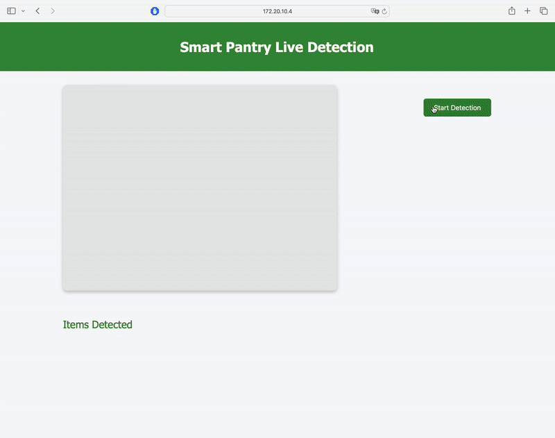

# 🤖 SmartPantry: Low-Cost Edge Deployment of a Grocery Monitoring & Malaysian Recipe Recommendation System

An intelligent pantry management system that uses YOLOv5 object detection to track pantry inventory and suggest recipes based on available ingredients, all running on a Raspberry Pi. This project was developed as a proof-of-concept to demonstrate the feasibility of using lightweight AI on edge devices to help reduce household food waste, aligning with UN Sustainable Development Goal 12.

<!-- INSERT A GIF OR SCREENSHOT OF THE SYSTEM IN ACTION HERE -->
<p align="center"></p>


## 🌟 About The Project

Food waste is a critical global challenge. A significant portion of this waste occurs at home due to inefficient grocery management and poor meal planning. This project tackles this problem by creating an automated system that keeps track of what's in your pantry and helps you use what you have.

The core of the system is a fine-tuned **YOLOv5n** model that visually recognizes 16 different types of pantry items. A **Flask** application orchestrates a real-time pipeline: it captures images from a camera, uses the AI model for detection, applies custom logic to stabilize the inventory, and logs the results in a **MariaDB** database. Based on the current inventory, the system can then recommend recipes, helping you cook with the ingredients you already own.

The entire application is designed to be lightweight and is deployed on a **Raspberry Pi 4**, proving that powerful AI solutions can be accessible and run efficiently on low-cost hardware.


## ✨ Features
*   **Real-Time Object Detection:** Utilizes a lightweight YOLOv5n model for fast and accurate detection of 16 pantry item classes.
*   **Automated Inventory Tracking:** The system automatically updates the inventory when items are added or removed, using a stabilization buffer to prevent flickering.
*   **Historical Logging:** A "soft delete" (`is_removed`) flag in the database maintains a history of all items that have been in the pantry.
*   **Intelligent Recipe Suggestions:** Recommends recipes from a database based on the currently available ingredients, ranked by the number of matches.
*   **Web-Based Demonstration Interface:** A basic and functional UI built with Flask to control the system and view results.
*   **Edge Deployment:** Fully operational on a Raspberry Pi 4, demonstrating a complete proof-of-concept for edge AI.


## 🛠️ Technology Stack
This project was built with the following key technologies:
*   **Python 3**
*   **AI / Computer Vision:**
    *   **PyTorch**
    *   **YOLOv5n** by Ultralytics
    *   **OpenCV**
*   **Backend & Server:**
    *   **Flask**
*   **Database:**
    *   **MariaDB** (as a drop-in replacement for MySQL)
    *   **SQLAlchemy** (ORM)
    *   **PyMySQL**
*   **Deployment Hardware:**
    *   **Raspberry Pi 4**


## 🚀 Getting Started

Follow these steps to set up and run the project locally or on your Raspberry Pi.

### Prerequisites

*   Python 3.8+
*   `pip` and `venv`
*   `git`
*   A running MariaDB or MySQL server instance.

### Installation & Setup

1.  **Clone the SmartPantry repository:**
    ```sh
    git clone https://github.com/lailixuann/SmartPantry
    cd SmartPantry
    ```

2.  **Set up the Python virtual environment:**
    ```sh
    # Create the virtual environment
    python3 -m venv smartPantry_env

    # Activate it
    source smartPantry_env/bin/activate
    ```

3.  **Install core Python libraries:**
    ```sh
    pip install cryptography flask flask_sqlalchemy flask_cors opencv-python torch numpy pandas pymysql mysql-connector-python
    ```

4.  **Set up YOLOv5:**
    The system requires the YOLOv5 repository for its utility functions.
    ```sh
    # Clone the official YOLOv5 repository
    git clone https://github.com/ultralytics/yolov5.git

    # Install its specific requirements
    pip install -r yolov5/requirements.txt  
    ```
    *_Note: Ensure the `yolov5` folder and the `app.py` file are in the same root directory._*

5.  **Set up the Database:**
    *   Log in to your MariaDB/MySQL server.
    *   Create the database using the provided SQL script. This will create the database named `object_detection_db`.
    ```sh
    mysql -u root -p < setup.sql
    ```
    *   **_Important:_** Open `app.py` and update the `SQLALCHEMY_DATABASE_URI` line with your own database username, password, and host if they are different from the default.

### Running the Application

1.  **Run the Flask App:**
    Make sure your virtual environment is activated.
    ```sh
    python3 app.py
    ```
    The application will start and be accessible at `http://127.0.0.1:5000` (or `http://<your-pi-ip-address>:5000`).

2.  **Populate the Recipe Database (One-time setup):**
    Open a *new terminal window*, activate the virtual environment again, and run the script to insert the recipes into your database.
    ```sh
    source venv/bin/activate
    python3 insert_recipes.py
    ```


## 📖 Usage
1.  Open your web browser and navigate to the application URL.
2.  Click **"Start Detection"** to begin the real-time camera feed and object detection.
3.  Place pantry items in front of the camera. The "Current Pantry" list will update automatically.
4.  Click **"Generate Recipes"** to see a list of suggested recipes based on the detected items.
5.  Click **"Stop Detection"** to end the session.


## 🛣️ Future Work

This proof-of-concept provides a strong foundation for many exciting future enhancements:
*   **Quantity Counting:** Implement algorithms to count the number of instances of each item.
*   **Expiry Date Recognition:** Integrate an OCR module to read expiry dates from packaging.
*   **AI-Powered Recommendations:** Use NLP to provide personalized recipe suggestions based on dietary needs.
*   **Full-Scale Application:** Develop a polished, consumer-ready mobile/web app with user accounts and push notifications.


## 📧 Contact

Lai Li Xuan - [@lailixuann](https://github.com/lailixuann)
Project Link: [https://github.com/lailixuann/SmartPantry](https://github.com/lailixuann/SmartPantry)
